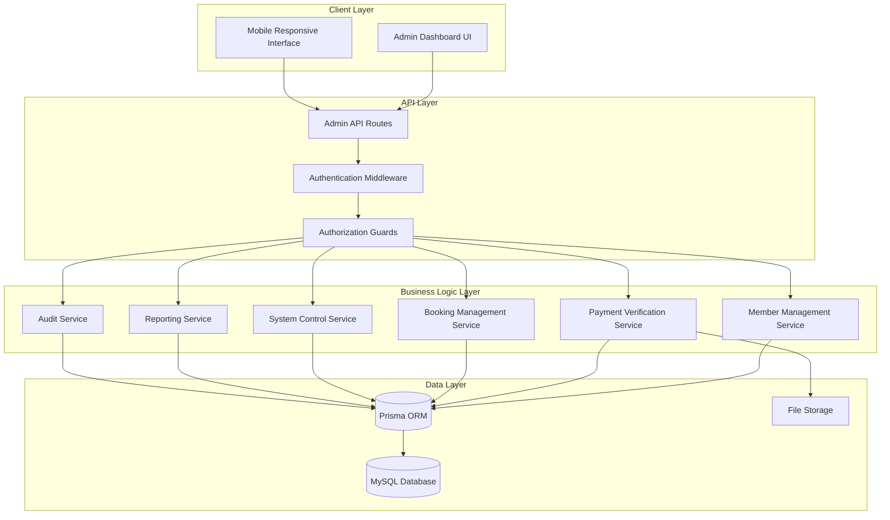

# Admin Dashboard Design Document

## Overview

Admin Dashboard เป็นระบบจัดการแบบครอบคลุมสำหรับผู้ดูแลระบบจองสนามแบดมินตัน ออกแบบให้ใช้งานง่าย มีประสิทธิภาพ และรองรับการทำงานแบบ real-time โดยใช้สถาปัตยกรรมแบบ modular ที่สามารถขยายได้ในอนาคต

## Architecture

### System Architecture



### Technology Stack

- **Frontend**: Next.js 14, React, TypeScript, PrimeReact, TailwindCSS
- **Backend**: Next.js API Routes, Prisma ORM
- **Database**: MySQL (existing schema)
- **Authentication**: NextAuth.js with role-based access
- **File Storage**: Local file system with encryption
- **Real-time**: Server-Sent Events (SSE) for notifications

## Components and Interfaces

### 1. Admin Layout Component

```typescript
interface AdminLayoutProps {
  children: React.ReactNode;
  title?: string;
  breadcrumbs?: BreadcrumbItem[];
}

interface BreadcrumbItem {
  label: string;
  href?: string;
  icon?: string;
}
```

### 2. Member Management Components

#### MemberList Component
```typescript
interface MemberListProps {
  filters: MemberFilters;
  onFilterChange: (filters: MemberFilters) => void;
  onMemberSelect: (member: UserProfile) => void;
}

interface MemberFilters {
  status: 'all' | 'pending' | 'active' | 'inactive' | 'suspended';
  role: 'all' | 'student' | 'staff' | 'guest';
  searchTerm: string;
  dateRange: DateRange;
}
```

#### MemberDetail Component
```typescript
interface MemberDetailProps {
  member: UserProfile;
  onApprove: (userId: string) => Promise<void>;
  onReject: (userId: string, reason: string) => Promise<void>;
  onStatusChange: (userId: string, status: UserStatus) => Promise<void>;
}
```

### 3. Payment Verification Components

#### PaymentQueue Component
```typescript
interface PaymentQueueProps {
  payments: PendingPayment[];
  onPaymentSelect: (payment: PendingPayment) => void;
  onBulkAction: (paymentIds: string[], action: 'approve' | 'reject') => Promise<void>;
}

interface PendingPayment {
  payment_id: string;
  reservation_id: string;
  user_info: UserBasicInfo;
  amount_cents: number;
  uploaded_at: Date;
  slip_url: string;
  booking_details: BookingInfo;
}
```

#### PaymentVerification Component
```typescript
interface PaymentVerificationProps {
  payment: PendingPayment;
  onApprove: (paymentId: string) => Promise<void>;
  onReject: (paymentId: string, reason: string) => Promise<void>;
}
```

### 4. Advanced Booking Components

#### AdminBookingForm Component
```typescript
interface AdminBookingFormProps {
  onSubmit: (booking: AdminBookingRequest) => Promise<void>;
  facilities: Facility[];
  defaultValues?: Partial<AdminBookingRequest>;
}

interface AdminBookingRequest {
  facility_id: string;
  court_ids: string[];
  date_range: DateRange;
  time_slots: TimeSlot[];
  recurring_pattern?: RecurringPattern;
  booking_reason: BookingReason;
  notes?: string;
  user_id?: string; // For booking on behalf of user
}

interface RecurringPattern {
  type: 'weekly' | 'monthly';
  interval: number;
  end_date: Date;
  days_of_week?: number[]; // For weekly pattern
}
```

### 5. System Control Components

#### SystemSettings Component
```typescript
interface SystemSettingsProps {
  settings: SystemSettings;
  onSettingsUpdate: (settings: Partial<SystemSettings>) => Promise<void>;
}

interface SystemSettings {
  booking_enabled: boolean;
  maintenance_mode: boolean;
  maintenance_message: string;
  payment_timeout_minutes: number;
  max_advance_booking_days: number;
  max_slots_per_user_per_day: number;
}
```

#### BlackoutManager Component
```typescript
interface BlackoutManagerProps {
  blackouts: Blackout[];
  onCreateBlackout: (blackout: CreateBlackoutRequest) => Promise<void>;
  onUpdateBlackout: (id: string, blackout: UpdateBlackoutRequest) => Promise<void>;
  onDeleteBlackout: (id: string) => Promise<void>;
}

interface CreateBlackoutRequest {
  facility_id: string;
  court_id?: string;
  start_datetime: Date;
  end_datetime: Date;
  reason: string;
  recurring?: RecurringPattern;
}
```

### 6. Reporting Components

#### ReportGenerator Component
```typescript
interface ReportGeneratorProps {
  onGenerateReport: (config: ReportConfig) => Promise<void>;
  availableReports: ReportTemplate[];
}

interface ReportConfig {
  template_id: string;
  date_range: DateRange;
  filters: ReportFilters;
  format: 'pdf' | 'excel' | 'csv';
  delivery_method: 'download' | 'email';
}

interface ReportTemplate {
  id: string;
  name: string;
  description: string;
  category: 'usage' | 'revenue' | 'members' | 'system';
  available_filters: FilterDefinition[];
}
```

## Data Models

### Extended User Profile
```typescript
interface AdminUserProfile extends UserProfile {
  registration_date: Date;
  last_login_at?: Date;
  booking_count: number;
  total_spent_cents: number;
  status_history: StatusChange[];
  verification_documents?: Document[];
}

interface StatusChange {
  from_status: UserStatus;
  to_status: UserStatus;
  changed_by: string;
  changed_at: Date;
  reason?: string;
}
```

### Admin Booking Model
```typescript
interface AdminBooking extends Reservation {
  booking_reason: BookingReason;
  created_by_admin: string;
  is_recurring: boolean;
  parent_booking_id?: string;
  recurring_pattern?: RecurringPattern;
  override_policies: boolean;
}

interface BookingReason {
  category: 'teaching' | 'training' | 'event' | 'maintenance' | 'other';
  description: string;
}
```

### System Audit Log
```typescript
interface AuditLog {
  log_id: string;
  admin_id: string;
  action: AdminAction;
  target_type: 'user' | 'booking' | 'payment' | 'system';
  target_id?: string;
  details: Record<string, any>;
  ip_address: string;
  user_agent: string;
  created_at: Date;
}

type AdminAction = 
  | 'member_approve' | 'member_reject' | 'member_suspend'
  | 'payment_approve' | 'payment_reject'
  | 'booking_create' | 'booking_cancel' | 'booking_modify'
  | 'system_setting_change' | 'blackout_create' | 'blackout_delete'
  | 'report_generate' | 'data_export';
```

## Error Handling

### Error Response Format
```typescript
interface AdminApiError {
  success: false;
  error: string;
  error_code: AdminErrorCode;
  details?: Record<string, any>;
  timestamp: Date;
}

type AdminErrorCode = 
  | 'INSUFFICIENT_PERMISSIONS'
  | 'MEMBER_NOT_FOUND'
  | 'PAYMENT_ALREADY_PROCESSED'
  | 'BOOKING_CONFLICT'
  | 'SYSTEM_MAINTENANCE'
  | 'INVALID_DATE_RANGE'
  | 'REPORT_GENERATION_FAILED';
```

### Error Handling Strategy
1. **Client-side validation** - Immediate feedback for form inputs
2. **Server-side validation** - Comprehensive data validation
3. **Transaction rollback** - Ensure data consistency
4. **User-friendly messages** - Clear error communication in Thai
5. **Audit logging** - Track all error occurrences

## Testing Strategy

### Unit Testing
- **Service layer testing** - Business logic validation
- **API route testing** - Endpoint functionality
- **Component testing** - UI component behavior
- **Utility function testing** - Helper functions

### Integration Testing
- **Database operations** - Prisma query testing
- **Authentication flow** - Role-based access testing
- **File upload/download** - Payment slip handling
- **Email notifications** - Notification system testing

### End-to-End Testing
- **Admin workflows** - Complete user journeys
- **Permission boundaries** - Access control validation
- **Data consistency** - Multi-step operation testing
- **Performance testing** - Load and stress testing

### Test Data Management
```typescript
interface TestDataFactory {
  createTestUser(role: UserRole, status?: UserStatus): Promise<UserProfile>;
  createTestBooking(userId: string, options?: BookingOptions): Promise<Reservation>;
  createTestPayment(reservationId: string, status?: PaymentStatus): Promise<Payment>;
  cleanupTestData(): Promise<void>;
}
```

## Security Considerations

### Authentication & Authorization
- **Role-based access control** - Admin-only routes
- **Session management** - Secure session handling
- **Permission granularity** - Feature-level permissions
- **Multi-factor authentication** - Optional 2FA for admins

### Data Protection
- **Input sanitization** - Prevent injection attacks
- **File upload security** - Validate payment slip uploads
- **Data encryption** - Sensitive data protection
- **Audit trails** - Complete action logging

### API Security
```typescript
interface AdminMiddleware {
  requireAdmin: (req: NextRequest) => Promise<AdminUser | null>;
  requirePermission: (permission: AdminPermission) => Middleware;
  rateLimiting: (limit: number, window: number) => Middleware;
  auditLog: (action: AdminAction) => Middleware;
}

type AdminPermission = 
  | 'member_management'
  | 'payment_verification'
  | 'booking_management'
  | 'system_control'
  | 'report_generation'
  | 'audit_access';
```

## Performance Optimization

### Database Optimization
- **Indexed queries** - Optimized search performance
- **Connection pooling** - Efficient database connections
- **Query optimization** - Minimize database calls
- **Caching strategy** - Redis for frequently accessed data

### Frontend Optimization
- **Code splitting** - Lazy load admin modules
- **Virtual scrolling** - Handle large data lists
- **Debounced search** - Optimize search performance
- **Memoization** - Cache expensive calculations

### Real-time Updates
```typescript
interface AdminNotificationService {
  subscribeToPaymentUpdates(callback: (payment: PendingPayment) => void): () => void;
  subscribeToBookingUpdates(callback: (booking: Reservation) => void): () => void;
  subscribeToMemberUpdates(callback: (member: UserProfile) => void): () => void;
  broadcastSystemMessage(message: SystemMessage): Promise<void>;
}
```

## Deployment Considerations

### Environment Configuration
```typescript
interface AdminConfig {
  ADMIN_SESSION_TIMEOUT: number;
  MAX_FILE_UPLOAD_SIZE: number;
  REPORT_GENERATION_TIMEOUT: number;
  AUDIT_LOG_RETENTION_DAYS: number;
  NOTIFICATION_EMAIL_FROM: string;
  BACKUP_SCHEDULE_CRON: string;
}
```

### Monitoring & Logging
- **Application monitoring** - Performance metrics
- **Error tracking** - Automated error reporting
- **Usage analytics** - Admin feature usage
- **Security monitoring** - Suspicious activity detection

This design provides a comprehensive foundation for the Admin Dashboard while maintaining consistency with the existing system architecture and ensuring scalability for future enhancements.